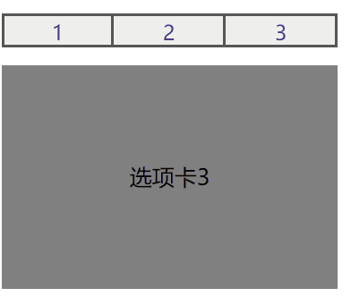

## a标签的target属性

<a> 标签定义超链接，用于从一个页面链接到另一个页面，原本功能有链接跳转、页面锚点、发送邮件等。在和朋友交流的过程中，了解到一个新功能。

为<a>标签设置锚点，在设置锚点以后可以通过“:target”选择所要跳转的锚点。

```html
<!DOCTYPE html>
<html lang="zh-CN">
<head>
	<meta charset="UTF-8">
	<title>Document</title>
	<style>	
		ul,li {
			list-style: none;
		}	
		ul {
			overflow: hidden;
			padding: 0;
			position: relative;
		}
		li {
			float: left;
			width: 100px;
			height: 30px;
			box-sizing: border-box;
			border: 2px;
			border-style: solid;
			border-color: #555;
			background: #eee;
			text-align: center;
		}
		li a {
			display: inline-block;
			font-size: 18px;
			line-height: 30px;
			width: 100%;
			height: 100%;
			text-decoration: none;
		}
		li:not(:first-of-type) {
			border-left: 0;
		}
		.div1 div {
			width: 300px;
			height: 200px;
			position: absolute;
			line-height: 200px;
			text-align: center;
			font-size: 20px;
		}
		#a1 {
			background: pink;
		}
		#a2 {
			background: purple;
		}
		#a3 {
			background: gray;
		}
		.div1 div:target {
			z-index: 9;
		}
		a:target {
			background: red;
		}
	</style>
</head>
<body>
	<div class="div1">
		<ul>
			<li><a href="#a1">1</a></li>
			<li><a href="#a2">2</a></li>
			<li><a href="#a3">3</a></li>
		</ul>
		<div id="a1">选项卡1</div>
		<div id="a2">选项卡2</div>
		<div id="a3">选项卡3</div>
	</div>	
</body>
</html>
```

可用于实现的功能有选项卡之类，可以用以上方法实现无需JavaScript的选项卡。但也因为是锚点，在可滚动的页面中使用会出现跳转。




