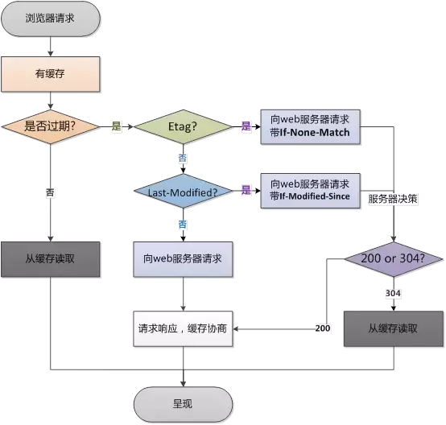

## ***HTTP***知识点

### 目录

<ol>
    <li><a href="#HTTP基本概念">HTTP基本概念</a></li>
    <li><a href="#请求方法">请求方法</a></li>
    <li><a href="#状态码">状态码</a></li>
    <li><a href="#HTTP1.0、HTTP1.1和HTTP2.0的区别">HTTP1.0、HTTP1.1和HTTP2.0的区别</a></li>
    <li><a href="#HTTP和HTTPS的对比">HTTP和HTTPS的对比</a></li>
    <li><a href="#HTTP强缓存和协商缓存">HTTP强缓存和协商缓存</a></li>
</ol>

### ***HTTP***基本概念

***HTTP***，超文本传输协议，是一种用于分布式、协作式和超媒体信息系统的**应用层**协议，是一个客户端（用户）和服务端（网站）之间请求和应答的标准。

### 请求方法

HTTP/1.1协议中共定义了八种方法来以不同方式操作指定的资源：

`GET	`，`HEAD`，`POST`，`PUT`，`DELETE`，`TRACE`，`OPTION`，`CONNECT`

### 状态码

- 1xx 消息——请求已被服务器接收，继续处理
- 2xx 成功——请求已成功被服务器接收、理解、并接受
- 3xx 重定向——需要后续操作才能完成这一请求
- 4xx 请求错误——请求含有词法错误或者无法被执行
- 5xx 服务器错误——服务器在处理某个正确请求时发生错误

### ***HTTP1.0***、***HTTP1.1***和***HTTP2.0***的区别

### ***HTTP***和***HTTPS***的对比

### ***HTTP***强缓存和协商缓存

浏览器缓存是浏览器在本地磁盘对用户最近请求过的文档进行存储，当访问者再次访问同一页面时，浏览器就可以从本地磁盘加载文档。浏览器缓存是Web新能优化的重要方式。

浏览器缓存的作用：

- 减少冗余的数据传输
- 减少服务器负担
- 加快网页加载的速度

在浏览器第一次发起请求时，本地没有缓存，向web服务器发送请求，服务器端响应请求，浏览器缓存。过程如下：

当再次发送相同请求时：

