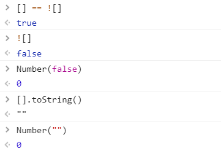
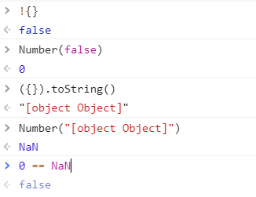

## 相等运算符(==)和严格运算符（===）

在之前的开发中，对“==”和“===”的认识比较浅显，在使用上也比较模糊。在遇到一道题目：

```js
[] == ![] //true
```

之后，我确定又发现了一个知识盲区。于是决定补上这个坑。

### 知识点

“===”叫做**严格运算符**，”==”叫做**相等运算符**。

**严格运算符**的运算规则简单：

1. 如果运算符左右**类型不同**，就**不相等**，也可看作类型相同是严格运算判等的前提。
2. 如果左右都为`number`类型，并且**数值相等**，就**相等**；如果其中至少一个是`NaN`，那么**不相等**。（如果要判断一个值是不是`NaN`，只能用***isNaN*()**来进行判断）。
3. 如果左右都是`string`类型，每个位置的字符都一样，那么**相等**；否则**不相等**。
4. 如果左右都是`boolean`类型，**值相等**，则**相等**。
5. 如果左右同是`null`或者同是`undefined`，则**相等**。
6. 如果左右都是`object`类型，当它们**引用**的**对象**或者**函数相同**，也就是所存储的指针相同时，则**相等**。

而**相等运算符**相较于**严格运算符**规则，要复杂一些：

1. 如果两个值类型相同，进行**严格运算符**比较。

2. 类型不同时，会对不同类型的值进行转换：

   1. 如果一个是`null`、一个是`undefined`，那么**相等**。
   2. 如果任一值是`string`，另一个值是`number`，在比较相等性之前先将`string`转换为`number`；即是调用***Number*()**函数。
   3. 如果任一值时`boolean`，则在比较相等性之前先将其转换为`number`，即是调用***Number*()**函数。
   4. 如果一个是`object`，另一个是`number`或`string`，把`object`转换成基础类型的值再比较。对象转换成基础类型，利用它的***toString*()**或者***valueOf*()**方法。 js核心内置类，会尝试***valueOf*()**先于***toString*()**；例外的是`Date`，其利用的是***toString*()**转换。

在了解“==”的机制之后，我们再来对题目进行分析：

```js
[] == ![]
//1.![]会将数组转成布尔型 >false
//2.有了布尔型之后，根据规则3，会将其转成数值型 >0
//3.当两边是数值型和对象时，依照规则4，对对象使用toString() >""
//4.现在两边一边是数值型，一边是字符串，按照规则2，将字符串转成数值型 >0
//5.因为 0 == 0，所以结果是 >true 
```



拓展：有了上面的题目，我们能想到更多几个题目。

```js
{} == !{} //false
[] == [] //false
{} == {} //false
```

我们是用相同的方法对题目进行推理

```js
{} == !{} //false
//1.!{}会将对象转成布尔型 >false
//2.有了布尔型之后，根据规则3，会将其转成数值型 >0
//3.当两边是数值型和对象时，依照规则4，对对象使用toString() >"[object Object]"
//4.现在两边一边是数值型，一边是字符串，按照规则2，将字符串转成数值型 >NaN
//5.因为 0 == 0，所以结果是 >false
```



另外两题原理相同

```js
[] == [] //false
{} == {} //false
// 左右两边类型相同，按照严格运算符进行运算
// 而对象的严格运算只比较它们引用的对象是否相等，很显然，左右两边并不是同一个对象，可以得知结果都是不等。
```


